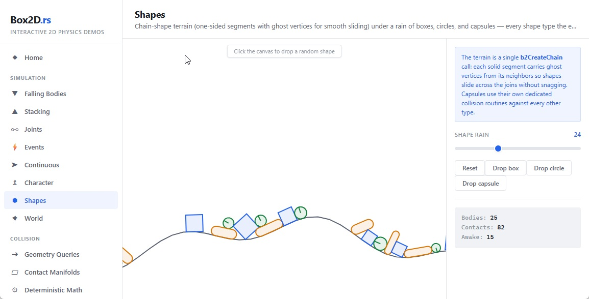

# box2d-rust

A pure Rust port of [Box2D v3](https://github.com/erincatto/box2d), Erin Catto's 2D physics
engine — exact behavioral match, including cross-platform deterministic math.

[](https://crates.io/crates/box2d-rust)
[](https://docs.rs/box2d-rust)
[](LICENSE)
[](https://larsbrubaker.github.io/box2d-rust/)

## Interactive Demo

**[Try it in your browser — no installation required](https://larsbrubaker.github.io/box2d-rust/)**

[](https://larsbrubaker.github.io/box2d-rust/)

Live WebAssembly demos running the ported engine — all 13 upstream sample categories:
bodies, shapes, stacking, joints, events, continuous collision, character movers, world
queries and explosions, determinism (live snapshot/restore with bit-identical state
hashes), overlap-recovery robustness, and benchmarks.

> Part of the [rust-apps](https://github.com/larsbrubaker/rust-apps) suite — a collection of
> Rust graphics and geometry libraries by Lars Brubaker.

## Status: Complete

Every portable module of the Box2D v3.1 C source is ported, together with the C test suite
(129 tests, green in both precision modes). The pinned reference source lives in the
`box2d-cpp-reference/` submodule.

| Area | Ported | Tests |
|---|---|---|
| Foundation: math_functions, core/constants, id, bitset, id_pool, table, types | ✅ | ✅ (test_math/id/bitset/table.c) |
| Collision: aabb, distance (GJK/TOI), hull, geometry, manifold, dynamic_tree | ✅ | ✅ (test_collision/distance/shape/dynamic_tree.c) |
| Broad phase: proxy ops, move buffer, pair update → contact creation | ✅ | ✅ |
| Dynamics: body/shape/contact lifecycles, constraint graph, solver sets, islands | ✅ | ✅ |
| Joints: distance, motor, filter, prismatic, revolute, weld, wheel | ✅ | ✅ |
| Solver: contact solver + serial step pipeline, sensors, sleeping, continuous | ✅ | ✅ (test_world.c) |
| World API: queries, casts, character movers, explosions, all setters | ✅ | ✅ |
| Determinism: hand-rolled trig, bit-exact FallingHinges vs the C build | ✅ | ✅ (test_determinism.c) |
| Snapshots: `world_snapshot` / `world_restore`, deep state hash | ✅ | ✅ (test_snapshot.c) |
| Recording: full op-stream record/replay of every API mutation and query | ✅ | ✅ (test_recording.c) |
| Replay player: incremental playback, keyframe ring, timeline scrub, outliner | ✅ | ✅ (test_recording.c viewer subtests) |
| Debug draw: `world_draw` with the complete `DebugDraw` trait + color palette | ✅ | ✅ |
| Large world mode (`double-precision` feature = `BOX2D_DOUBLE_PRECISION`) | ✅ | ✅ (test_large_world.c) |

Not ported (by design): threading/task system (the port is serial), the global world
registry (worlds are owned values), and the C arena allocator (Rust `Vec`s).

## Performance

The port is measured against the C reference using the C repo's own `benchmark` app (10
scenes) and a line-for-line Rust port of it (`examples/benchmark`, run with
`cargo run --release --example benchmark`). Both run **single-threaded** — the Rust port is
serial by design, so C runs with `-w=1` (its serial fallback, no scheduler). Both use the
same scenes, the same constants, `dt = 1/60`, 4 sub-steps, and the warm-up step excluded.

Methodology: scenes are measured **interleaved** — C then Rust for each scene, back-to-back,
minimum of 2 runs kept per scene. This mobile CPU thermally throttles under sustained load,
so a sequential whole-suite comparison (all of C, then all of Rust) is unfair: the second
suite runs hotter and slower. Measuring each scene's C and Rust builds from equal thermal
state makes the ratio — the stable quantity — meaningful; absolute times still vary with
hardware. Intel Core i7-7660U (2C/4T mobile, 2017) · 8 GB RAM · Windows 10 · rustc 1.91.0
(release) vs MSVC 19.x /O2 (VS 2022 Build Tools) · C reference @ submodule pin `56edae7` ·
updated 2026-07-19.

Total ms for the scene's full step count (min of 2 runs, interleaved):

| Scene | Steps | C (ms) | Rust (ms) | Rust / C |
|---|---|---|---|---|
| compounds | 500 | 3429 | 5039 | 1.47× |
| joint_grid | 500 | 5421 | 5907 | 1.09× |
| junkyard | 800 | 7327 | 11892 | 1.62× |
| large_pyramid | 500 | 2618 | 5541 | 2.12× |
| many_pyramids | 200 | 5386 | 9209 | 1.71× |
| rain | 1000 | 15814 | 20897 | 1.32× |
| smash | 300 | 2848 | 3701 | 1.30× |
| spinner | 500 | 8224 | 9939 | 1.21× |
| tumbler | 750 | 2609 | 3662 | 1.40× |
| washer | 500 | 9014 | 13291 | 1.47× |

Geometric mean ≈ **1.45× slower than C** (range 1.09–2.12×), down from 1.9× at first
measurement.

### What closed the gap

The largest win was not an algorithm change but a build-configuration bug. The port ran C's
`B2_VALIDATE`-only structure validators (notably `b2ValidateIsland`) in **release** builds;
on island-churning scenes that walk is effectively quadratic. Gating those validators to
debug builds (matching C, where `B2_VALIDATE` compiles out of release) took spinner from
2.73× to 1.21×, back in line with C. Also landed: fat LTO + `codegen-units=1`, a zero-copy
in-place collide driver matching C's access pattern, and minor capsule `sqrt` reuse.

### What remains

1. **SIMD contact solver.** C solves graph-color contacts in hand-written 4/8-wide `b2FloatW`
   kernels; the port is scalar. This is `large_pyramid`'s remaining 2.12× and part of the
   ~1.3–1.7× on other contact-heavy scenes. The joint solver (scalar in C too) is already at
   1.09×, which shows the contact path is where the width matters. Plan: port the wide kernels
   as a lane-wise `[f32; 4]` newtype mirroring `b2ContactConstraintSIMD`. Per-lane arithmetic
   is bit-identical to scalar, so determinism is preserved — the current scalar solver already
   matches C's SIMD results bit-for-bit.
2. **Residual scalar codegen differences (~1.3×)** on contact-heavy scenes — profile after the
   SIMD port lands, since the layout change may absorb some of it.

Multithreading (a work-stealing solver like C's built-in scheduler) is a separate, larger
lever — the C version gains ~Nx with workers; the port is serial today by design.

## Porting principles

- **Exact behavioral match** — same algorithms, same `f32` arithmetic, same edge cases as the C
  source. Floating-point operations are never reordered or "improved".
- **Determinism preserved** — Box2D's hand-rolled `b2Atan2` and `b2ComputeCosSin` (built for
  cross-platform determinism) are ported bit-for-bit, never replaced with std functions.
- **Tests ported too** — every module lands together with its portion of the C test suite.
- **No stubs** — no `todo!()`, no placeholders; modules are ported whole, in dependency order.
- **Large world mode** — the `double-precision` cargo feature mirrors `BOX2D_DOUBLE_PRECISION`.

The approach follows
[HOW_WE_PORTED_CLIPPER2.md](https://github.com/larsbrubaker/clipper2-rust/blob/main/HOW_WE_PORTED_CLIPPER2.md)
from our Clipper2 port.

## Development

```bash
# Clone with the C reference submodule
git clone --recurse-submodules https://github.com/larsbrubaker/box2d-rust.git

# Run tests (both precision modes)
cargo test
cargo test --features double-precision

# Full pre-commit gauntlet: file lengths, tests, fmt, clippy, build
./scripts/pre-commit-check.ps1   # or .sh
```

### Demo site

The demo site (`demo/`) mirrors the upstream `samples` app in the browser via WebAssembly.

The quickest way to see it — builds the wasm and serves the demo at
`http://localhost:3000`, opening your browser:

```
run_demo.cmd      # Windows (double-click or run from a terminal)
./run_demo.sh     # Linux / macOS
```

Or drive the steps yourself:

```bash
cd demo
bun install
bun run build:wasm   # wasm-pack build (once, and after Rust changes)
bun run dev          # dev server at http://localhost:3000, rebuilds wasm on Rust edits
```

Deployed automatically to GitHub Pages on push to `main`.

## Acknowledgments

- [Erin Catto](https://github.com/erincatto) — Box2D author
- [MatterHackers](https://www.matterhackers.com/) — sponsoring the port
- Ported with [Claude Code](https://claude.com/claude-code)
